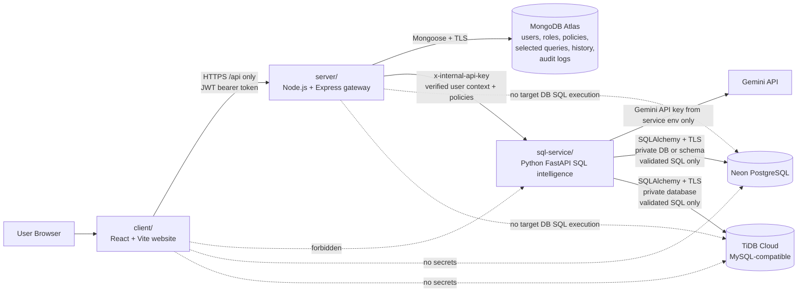
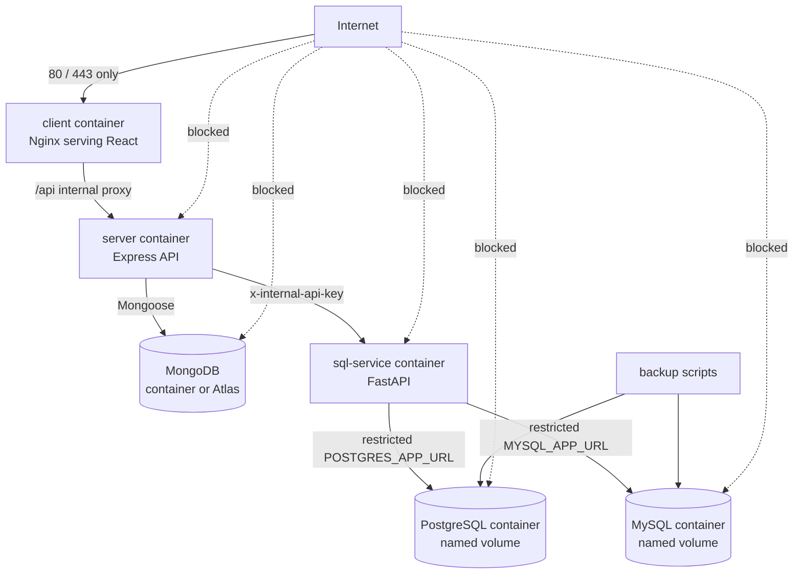
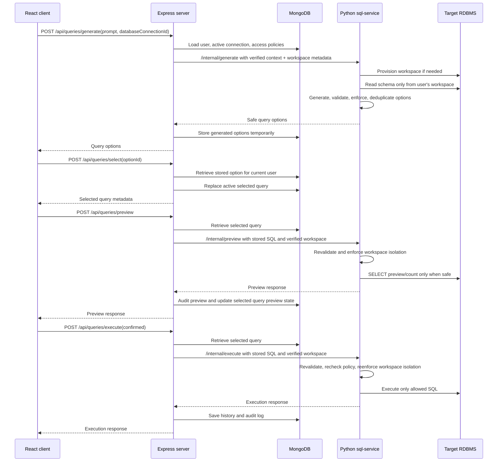

# Architecture

## Current Managed Cloud Architecture

## Deprecated Docker VPS Reference

This Docker VPS diagram is retained as a deprecated reference for older deployment experiments. The current preferred deployment uses managed MongoDB Atlas, Neon PostgreSQL, and TiDB Cloud rather than Docker-managed databases.

## Responsibilities

### client/

- React website only.
- Calls only the Express API base URL configured by `VITE_API_BASE_URL`.
- Stores JWT in `sessionStorage` for this college demo.
- Displays generated SQL, security-enforced SQL, preview, execution result, history, and audit UI.
- Does not call `sql-service/`.
- Does not contain MongoDB URLs, target database URLs, Gemini keys, or internal service keys.
- Does not make trusted authorization decisions.

### server/

- Node.js + Express gateway.
- MongoDB + Mongoose persistence.
- JWT authentication and bcrypt password hashing.
- Stores users, roles, database connection metadata, access policies, generated options, selected queries, query history, and audit logs.
- Builds trusted verified user context from MongoDB after JWT verification.
- Generates and stores private SQL workspace metadata for each user.
- Calls `sql-service/` using `x-internal-api-key`.
- Never exposes `SQL_SERVICE_URL`, `SQL_SERVICE_API_KEY`, MongoDB secrets, Gemini keys, or target database credentials to React.
- Never accepts arbitrary SQL from React for preview or execution.

### sql-service/

- Python FastAPI internal service.
- Requires `x-internal-api-key` for `/internal/*`.
- Reads target database schema dynamically with SQLAlchemy.
- Lazily provisions one private workspace per user per cloud SQL engine.
- TiDB uses a private database per user.
- PostgreSQL uses a private database per user when `CREATEDB` is available, otherwise a private schema per user.
- Performs AI/NLP SQL generation with Gemini when configured.
- Performs SQL parsing, classification, validation, dialect handling, row-level enforcement, preview, and safe execution.
- Supports PostgreSQL and MySQL-compatible target databases through environment variables.
- Revalidates and reenforces row-level security before preview and again before execution.
- Uses managed database URLs configured only in the SQL service environment.
- Blocks database administration commands such as `CREATE DATABASE`, `DROP DATABASE`, `CREATE USER`, `GRANT`, and `ALTER SYSTEM`.

## Query Workflow

## Data Stores

- MongoDB stores application/security data only.
- Target relational databases store business data queried by SQL.
- Express stores only target database credential environment variable names, never raw target database passwords.
- The Python service reads the actual target database URL from its own environment.

## Security Boundaries

- React cannot call `sql-service/`.
- React cannot provide trusted role, allowed tables, columns, policies, or executable SQL.
- Express is the only caller of `sql-service/`.
- `sql-service/` treats AI SQL as untrusted and validates before returning options, before preview, and before execution.
- TCL is view-only.
- DCL and dangerous DDL are blocked.
- `DROP DATABASE`, `CREATE ROLE`, `ALTER SYSTEM`, `GRANT`, `REVOKE`, and unsafe infrastructure commands are blocked.
